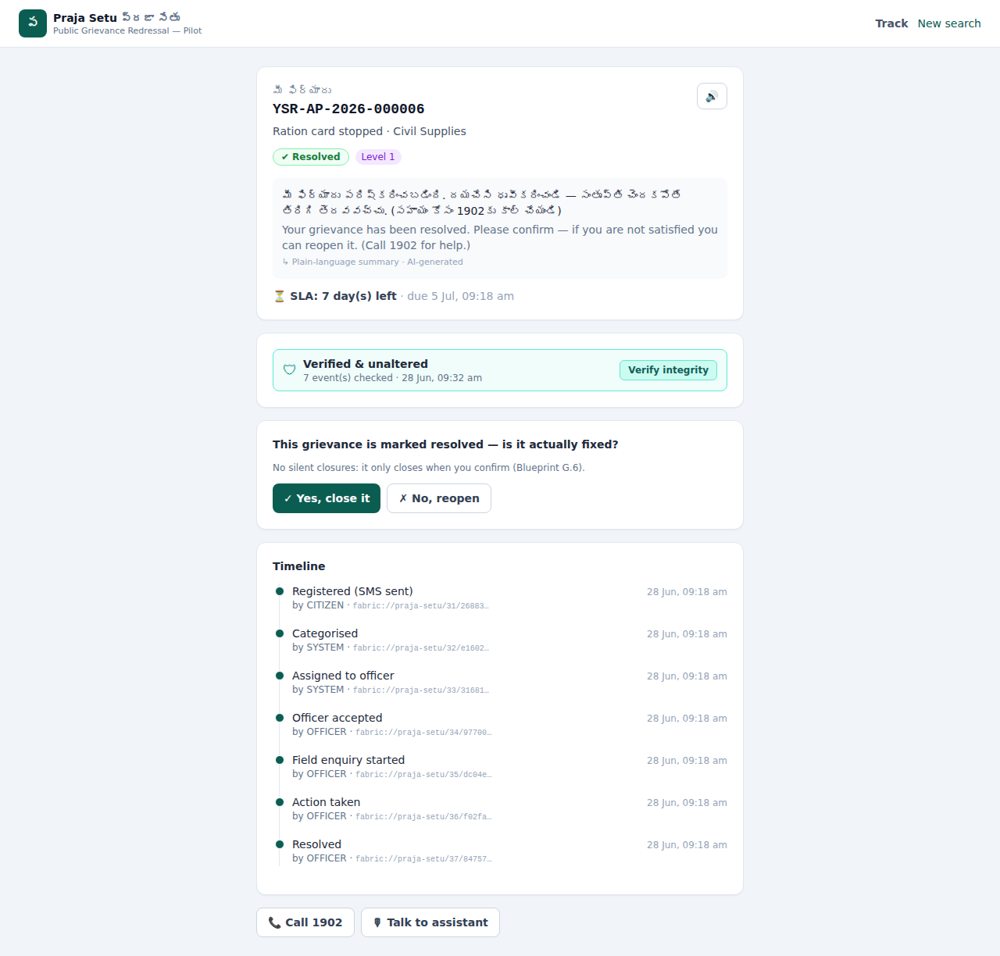
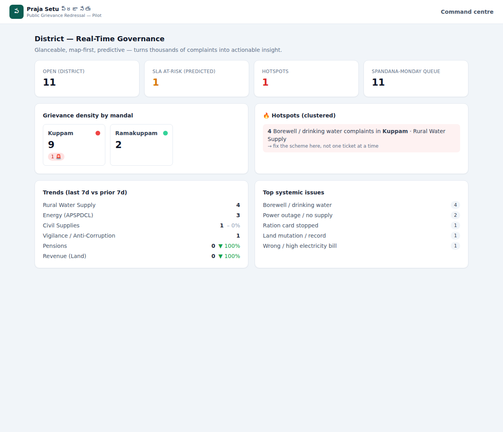

# SAARTHI — Public Grievance Redressal · Government of India

**A working pilot of a next-generation Public Grievance Redressal System (PGRS)**, built from
[`docs/PrajaSetu-Blueprint.md`](docs/PrajaSetu-Blueprint.md). **SAARTHI** ("guide / charioteer") is multilingual-first,
voice-first, and tamper-evident — designed to run in a single mandal/town before scaling. The brandmark is a charioteer's
wheel (chakra), and the system asks every citizen to **choose their language first**, then conducts the whole
grievance interview in that language by voice or text.

This repository is the **pilot MVP** the blueprint calls for in Part H — the deliberately narrow cut that proves value
and safety small. It compiles and runs end-to-end with **zero external services** (one command, SQLite, in-process
adapters), so you can see the whole grievance lifecycle work today.

---

## What's inside

| App | Stack | What it is |
|---|---|---|
| `apps/api` | **NestJS 10 · Prisma · PostgreSQL** | Core grievance services as a modular monolith; persistent, cross-device data in a managed Postgres (Neon/Supabase/Render) |
| `apps/web` | **Next.js 15 · React 19 · Tailwind** | Two portals (Citizen + Official), the six role-tuned surfaces (Part F), **12 Indian languages**, and a voice-first step-by-step filing form |

**Single login, two roles.** The landing first asks the citizen to **pick their language**, then shows one sign-in card:
**Citizen login** (mobile-OTP → dashboard → a guided, one-question-at-a-time complaint form with **speak-to-fill +
repeatable read-aloud + document upload** so low-literacy users can file unaided, in any of 12 Indian languages with the
transcript in their **native script**). A **Staff login** toggle (top-right of the same card) flips it to officer
sign-in → a role-based hub that shows the officer's **government designation** and the escalation ladder, and routes each
officer to only the workspaces their role allows. Officers can **compress uploaded image evidence** at the workbench and
run **detailed, consent-gated X-Road** verifications across departments. The public tracking ID is **`PGRS-…`**.

**Command console ("Calm command center").** Staff sign-in opens a unified, navy + antique-gold console whose signature
element is a persistent **AI co-pilot** (it summarises, routes, retrieves the governing orders and estimates SLA-breach
risk — but the **officer always decides**). It carries four production-grade dashboards — **District Command Center**
(KPIs · grievance-flow chart · co-pilot insights · department/SLA charts · live grievances table), **Officer AI
Workbench** (queue · complaint detail with voice transcript, evidence & notarised ledger timeline · co-pilot rail),
**GIS Intelligence & Hotspots**, and **Analytics & Predictions** — plus All-Grievances, Audit & Ledger, Citizens and
Administration. Charts use Chart.js; the whole console is bilingual **EN ⇄ తెలుగు** and wired to live pilot data.

### In-app navigation (web + mobile app)

The web UI is built to be embedded in a **mobile-app WebView** (which has no browser chrome) as well as used in a
browser, so navigation is self-contained:

- Every page header carries **Back** and **Home** controls, and a **bottom app-navigation bar** (Back · Home ·
  role-aware quick links — **Heatmap** and **Analytics** for supervisors/collectors/auditors, **New complaint** and
  **Track** for citizens) appears on phones. The app wrapper can open any URL with **`?app=1`** to keep the bar
  visible at every viewport width for that session.
- Console views are **deep-linkable**: `/staff?view=gis` opens GIS Intelligence & Hotspots (the heatmap) directly;
  `overview`, `workbench`, `grievances`, `analytics`, `citizens`, `audit` and `admin` work the same way. View changes
  push real history entries, so the Android hardware back button (wired to the WebView's `goBack()`) unwinds them
  naturally — Back never dead-ends.

### Screenshots

| Citizen tracking | Collector command centre |
|---|---|
|  |  |

(See [`docs/screenshots/`](docs/screenshots) for the operator console, officer workbench, supervisor and audit surfaces.)

---

## Honest scope — what's real vs. stubbed

The blueprint is scrupulously honest that several capabilities depend on **government onboarding** that can't exist in a
sandbox (Aadhaar AUA/KUA, X-Road governance, Hyperledger node operators, Bhashini production access). The pilot is
faithful to that honesty: each such capability is implemented behind a **clean adapter interface** with a pilot
stand-in, so the whole system runs end-to-end and a real client drops in later without touching the core.

| Capability | Pilot implementation (this repo) | Production path |
|---|---|---|
| **Tamper-evident ledger** (D.2) | **Real** SHA-256 hash-chained, append-only `AuditEvent` log with citizen "verify integrity" + DB-vs-ledger check. This *is* the blueprint's own sanctioned fallback (K.2). | Hyperledger Fabric chaincode behind `LedgerService` |
| **X-Road data exchange** (D.1) | Consent-gated, signed, logged cross-department lookups (canned facts) + access-transparency view | X-Road Security Servers behind `DataExchangeService` |
| **Bhashini NLP** (D.3) | ASR / NMT / TTS adapter (mock); keyword classifier over the seeded taxonomy; Jaccard dedup; distress detection | Bhashini/ULCA APIs behind `BhashiniService`; learned models |
| **LLM assist** (D.5) | Real **Claude** analysis (root cause + suggestions, dept-knowledge grounded) when `ANTHROPIC_API_KEY` is set, else a KB heuristic — read-only, AI-labelled, never decides/closes | RAG-grounded sovereign LLM behind `LlmService` |
| **Identity** (G.1) | Aadhaar **tokenised, never stored raw**; mobile-OTP login; officer JWT (mock Keycloak) | UIDAI eKYC + Aadhaar Data Vault; Keycloak OIDC + MFA |
| **Database** | **PostgreSQL** — persistent, cross-device (managed: Neon/Supabase/Render) | PostgreSQL + pgvector (add embeddings) |
| **Notifications** | Mock SMS/IVR/email persisted to `NotificationLog` | Real gateway behind `NotificationService` |

Everything else — the grievance **lifecycle state machine**, **PGRS tracking ID**, **geo + subject dynamic assignment**,
**SLA clock + breach prediction + auto-escalation (L1→L4)**, **reopen-to-higher-authority**, **no-silent-closure**,
**finance/non-finance rules**, **RBAC/ABAC**, **consent**, **hotspot/anomaly detection**, **dashboards** — is really
implemented and exercised by the seed + tests.

---

## Quick start

**Prerequisites:** Node.js ≥ 20 (tested on 22), npm, and a PostgreSQL database
(local Postgres, or a free managed one — Neon/Supabase/Render). Set
`apps/api/.env` → `DATABASE_URL` to your Postgres connection string.

```bash
# 1) Install + generate Prisma client + create the schema & seed the database
npm run setup:api      # apps/api: install, prisma generate, db push, seed
npm run setup:web      # apps/web: install

# 2) Run the two apps (separate terminals)
npm run dev:api        # → http://localhost:4000/api
npm run dev:web        # → http://localhost:3000
```

Then open **http://localhost:3000**.

> **Production-style run:** `npm run build` then `npm run start:api` / `npm run start:web`.

### Deploy (go live)

The app is container-ready. The quickest public deploy on any server with Docker:

```bash
JWT_SECRET=$(openssl rand -hex 32) docker compose -f docker-compose.prod.yml up -d --build
# → http://<server>:3000   (the web app proxies /api to the API privately — one public port)
```

Managed one-click options (Render blueprint in [`render.yaml`](render.yaml), plus Railway/Fly/Vercel)
and the full configuration reference are in **[`DEPLOY.md`](DEPLOY.md)**.

### Demo logins

Officer surfaces use mock Keycloak accounts — password **`Praja@123`**:

| Username | Role | Use it for |
|---|---|---|
| `da1` | Digital Assistant | Sachivalayam console |
| `rws.officer`, `cs.officer`, `pen.officer`, … | Officer | Officer workbench |
| `supervisor` | Supervisor | Supervisor / Mandal cell |
| `collector` | Collector | Command centre |
| `auditor` | Auditor | Audit & anti-corruption console |

Track a citizen grievance (no login) with a seeded tracking number, e.g. `PGRS-AP-2026-000001` (in progress),
`PGRS-AP-2026-000006` (resolved — awaiting your confirmation), `PGRS-AP-2026-000004` (closed).

---

## The six surfaces (Blueprint Part F)

1. **Citizen tracking** (`/track`) — plain-language Telugu status, timeline, **one-tap ledger integrity verification**,
   confirm-or-reopen (no silent closure), read-aloud (TTS).
2. **Sachivalayam operator console** (`/console`) — *the primary pilot UI.* Voice-first assisted filing, AI suggestion
   (human-confirmed), consent capture, PGRS no. + QR slip.
3. **Officer workbench** (`/officer`) — SLA-risk queue, AI summary, **X-Road verified facts inline**, AI draft-assist
   (human-approved), notarised actions.
4. **Supervisor / Mandal cell** (`/supervisor`) — SLA compliance, escalations, officer load, **anomaly leads**.
5. **Collector command centre** (`/command`) — heatmap, **hotspot clustering**, predictive SLA risk, systemic issues.
6. **Audit & anti-corruption** (`/audit`) — ledger verification, fraudulent-closure review, **masked** corruption queue,
   X-Road access transparency.

---

## How the blueprint maps to the code

```
apps/api/src/
  modules/
    grievances/      Intake + case-management state machine (Part E.2) — the heart
    classification/  NLP: keyword classify + dedup + distress (Part D.3, Appendix B)
    routing/         Smart routing to lowest competent officer, explainable (Part D.4)
    sla/             SLA clock + breach PREDICTION + auto-escalation L1→L4 (Part D.4, A.2)
    ledger/          Hash-chained tamper-evident notary + verify (Part D.2, G.4)
    dataexchange/    X-Road consent-gated signed/logged lookups (Part D.1)
    bhashini/        Telugu ASR/NMT/TTS adapter (Part D.3)
    llm/             Plain-language status + draft-assist, guard-railed (Part D.5)
    identity/        Aadhaar tokenisation + consent broker (Part E.1, G.1-G.2)
    auth/            Officer JWT (Keycloak-style) + citizen mobile OTP (Part G.1)
    dashboard/       Supervisor + command analytics, hotspots, anomalies (Part F.4-F.5)
    audit/           Ledger verify + fraud + corruption queue + access log (Part F.6, G.3)
    notification/    Mock SMS/IVR/email gateway (Part B.8)
    reference/       Departments, subject taxonomy, officers, X-Road catalogue
  common/
    state-machine.ts Allowed lifecycle transitions — enforces "no silent closure" etc.
    constants.ts     Statuses, roles, channels, ledger events, escalation levels
prisma/schema.prisma Data model (Part E.1)
prisma/seed.ts       Drives sample grievances through the REAL lifecycle (genuine ledger/SLA data)
```

### Anti-gaming rules, enforced in code (Blueprint E.2 / G.6)
- `RESOLVED → CLOSED` requires **citizen confirmation**, or supervisor force-close with **mandatory evidence + justification** (notarised).
- **Finance** grievances can't close until **benefit delivery is confirmed**.
- **Reopen always escalates** to a higher authority (an officer can't be judge of their own dismissal).
- **Every** lifecycle transition writes an `AuditEvent` to the hash-chain — so "closed in 2 minutes, no enquiry" is visible *and provable*.

---

## Verify it works

```bash
# API health
curl http://localhost:4000/api/health

# File a grievance (anonymous self-serve)
curl -X POST http://localhost:4000/api/grievances -H 'Content-Type: application/json' \
  -d '{"channel":"WEB","language":"te","description":"కరెంటు లేదు no power supply",
       "mobile":"9990001234","deptId":"ENERGY","subjectId":"ENERGY_OUTAGE",
       "category":"NON_FINANCE","mandal":"Kuppam"}'

# Citizen track + integrity (use a seeded ysr)
curl http://localhost:4000/api/grievances/public/PGRS-AP-2026-000001
```

The build was verified with a headless-Chromium pass over all six surfaces (intake → routing → tracking →
integrity verify → officer actions → dashboards) with **no compile errors and no runtime/page errors**.

---

## Scale path (Blueprint Part J)

The architecture grows without a rewrite:
- **DB:** switch `apps/api/prisma/schema.prisma` datasource `provider` to `postgresql`, point `DATABASE_URL` at the
  `db` service in [`docker-compose.yml`](docker-compose.yml), restore enum/array columns, `prisma db push`.
- **Services:** split the spiky concerns (AI/ML, notifications) out of the monolith; add Kafka for intake spikes.
- **Adapters:** replace each stub (`LedgerService`, `DataExchangeService`, `BhashiniService`, `LlmService`,
  identity/Keycloak) with the real client — the interfaces don't change.

---

## Note on the Prisma engine in this sandbox

In a normal environment `npm install` downloads Prisma's engine binaries automatically. This repo also ships
[`apps/api/scripts/fetch-prisma-engines.sh`](apps/api/scripts/fetch-prisma-engines.sh) (invoked by `npm run setup:api`)
which fetches them with `curl` — needed only where a TLS-terminating proxy blocks Prisma's own downloader. It is a no-op
when the engines are already present.

---

*Built from the blueprint, honestly scoped: real where it can be real, cleanly stubbed where the real thing needs
government onboarding — and runnable today.*
